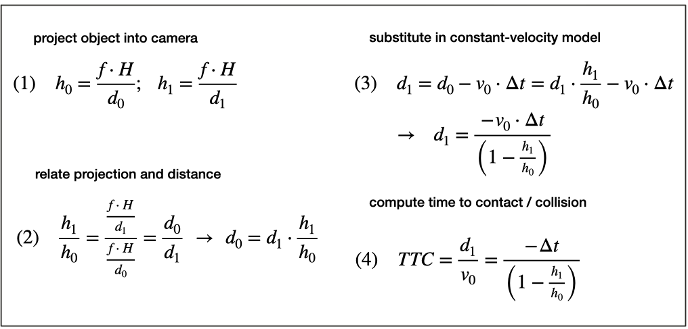
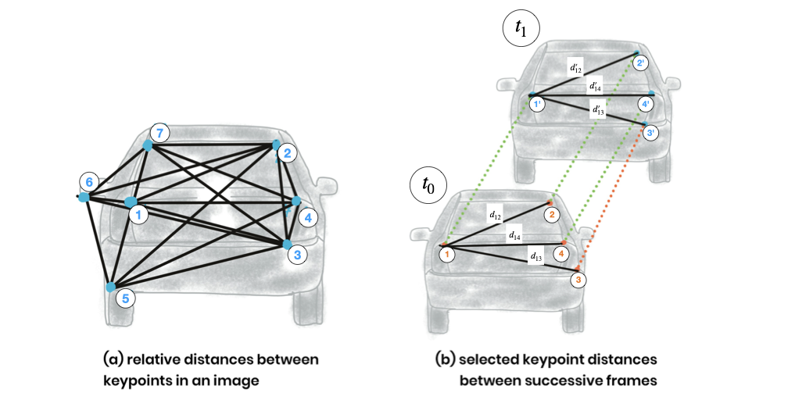
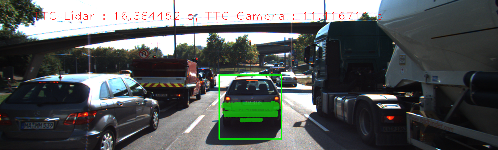
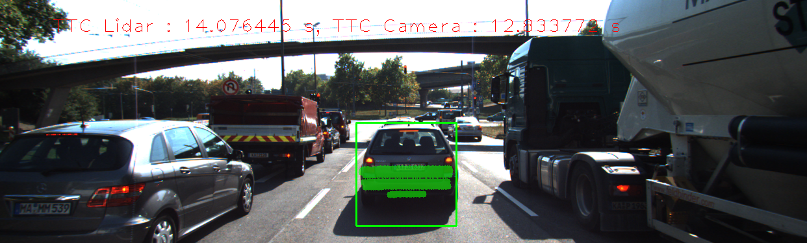
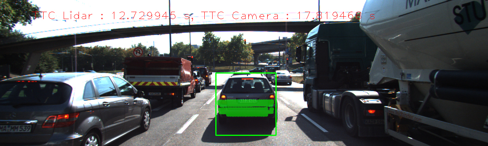
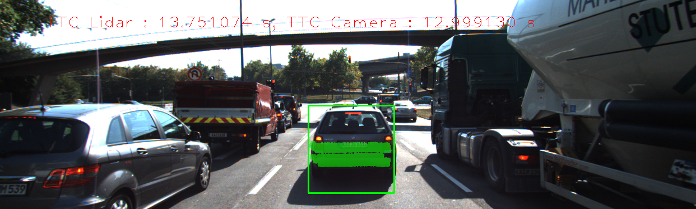

# SFND 3D Object Tracking

The objectives of the project:

- Have a solid understanding of keypoint detectors, descriptors, and methods to match them between successive images.
- Know how to detect objects in an image using the YOLO deep-learning framework. 
- Know how to associate regions in a camera image with Lidar points in 3D space. 

The full schematic for computing time to collision as below.


## Dependencies for Running Locally
* cmake >= 2.8
  * All OSes: [click here for installation instructions](https://cmake.org/install/)
* make >= 4.1 (Linux, Mac), 3.81 (Windows)
  * Linux: make is installed by default on most Linux distros
  * Mac: [install Xcode command line tools to get make](https://developer.apple.com/xcode/features/)
  * Windows: [Click here for installation instructions](http://gnuwin32.sourceforge.net/packages/make.htm)
* Git LFS
  * Weight files are handled using [LFS](https://git-lfs.github.com/)
* OpenCV >= 4.1

```
git clone https://github.com/opencv/opencv.git
cd opencv
git checkout 4.1.0
cd .. #get out of opencv folder
```

```
https://github.com/opencv/opencv_contrib/
cd opencv_contrib
git checkout 4.1.0
cd .. # get out of opencv_contrib folder
```

```
cd opencv
mkdir build
cd build
cmake -D CMAKE_BUILD_TYPE=RELEASE -D OPENCV_ENABLE_NONFREE=ON -D OPENCV_EXTRA_MODULES_PATH=../../opencv_contrib/modules -D WITH_GTK=ON ..
make
sudo make install
```

* gcc/g++ >= 5.4
  * Linux: gcc / g++ is installed by default on most Linux distros
  * Mac: same deal as make - [install Xcode command line tools](https://developer.apple.com/xcode/features/)
  * Windows: recommend using [MinGW](http://www.mingw.org/)

* Prepare YOLO weights
  * Weights: [https://pjreddie.com/media/files/yolov3.weights](https://pjreddie.com/media/files/yolov3.weights)
  * cfg: [https://github.com/pjreddie/darknet/blob/master/cfg/yolov3.cfg](https://github.com/pjreddie/darknet/blob/master/cfg/yolov3.cfg)

## How to run

1. Clone this repo.
2. Make a build directory in the top level project directory: `mkdir build && cd build`
3. Compile: `cmake .. && make`
4. Run it: `./3D_object_tracking`.

## The step-by-step implementation

1. First, I match 3D objects over time by using keypoint correspondences. <br>
  The implemetation is from line __#277__ to __#325__ in the file `src/camFusion_Student.cpp`

2. Second, I compute the TTC based on Lidar measurements. <br>
  The math fomulars to comput Lidar-based TTC is as the below figure:

  

  where `d0` and `d1` are the distance from the ego CAR with the preceding vehicle in the previous frame and the current frame. 
  I have tried 2 ways to compute d0 and d1:
  - Way 1: Based on the minimum distance
  - Way 2: Based on the average distance

  

  With the data in this project, the `sencond way` results in a much more stable TTC compared to the `first way`. Hence I used the `second way` as default. The code of this part is from #229 to #274 in `src/camFusion_Student.cpp`.

3. Third, I assign enclosed keypoint matches to bounding box <br>
  The code for this part is the `clusterKptMatchesWithROI()` function which is from line #139 to #175 in `src/camFusion_Student.cpp`.

4. Fourth, I compute the TTC based on those matches. <br>
  The math formulars to compute camera-based TTC

  
  


  The ratio of all relative distances between each other can be used to compute a reliable TTC estimate by replacing the height ratio _h_1 / h_0_ with the mean or median of all distance ratios _d_k / d_k'_.

  

  The code for this part is from #179 to #226 in `src/camFusion_Student.cpp`.


5. Finally, I conduct various tests with the framework to identify the most suitable detector/descriptor combination for TTC estimation and also to search for problems that can lead to faulty measurements by the camera or Lidar sensor.

I select the `FAST` keypoints detector and `ORB` keypoints descriptor as default because the combination can get the best stable performance compared to other combinations. For more information, please take a look at `/docs/` folder where I saved the output of the top-3 best detector/descriptor combinations.

Some result examples:








