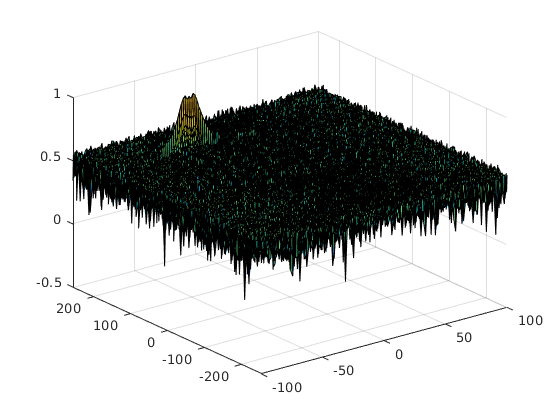

# Radar Target Generation and Detection

The project layout is described as the below figure

1. FMCW Waveform Design

    The Radar specifications: 
    

    From line **#36** to line **#38**, I calculated the Bandwidth (B), Chirp Time (Tchirp) and Slope (slope) of the FMCW chirp using the above requirements.

    I defined the target's initial position and velocity:
    - R0 = 150 meter
    - V = -40 m/s

2. Range FFT (1st FFT)

    The steps to solve the task:
    - Implement the 1D FFT on the Mixed Signal
    - Reshape the vector into Nr*Nd array.
    - Run the FFT on the beat signal along the range bins dimension (Nr)
    - Normalize the FFT output.
    - Take the absolute value of that output.
    - Keep one half of the signal
    - Plot the output
    - There is a peak at the initial position of the target

    The code implementation of this part is from line **#45** to line **#159**.

    Results:

    

    

3. 2D CFAR

    The steps to solve the task:
    - Determine the number of Training cells and the number of guard cells for each dimension.
    - Slide the cell under test across the complete matrix. Make sure the CUT has margin for Training and Guard cells from the edges.
    - For every iteration sum the signal level within all the training cells. To sum convert the value from logarithmic to linear using db2pow function.
    - Average the summed values for all of the training cells used. After averaging convert it back to logarithmic using pow2db.
    - Further add the offset to it to determine the threshold.
    - Next, compare the signal under CUT against this threshold.
    - If the CUT level > threshold assign it a value of 1, else equate it to 0.

    The code implementation of this part is from line **#161** to line **#251**.

    Results:

    
