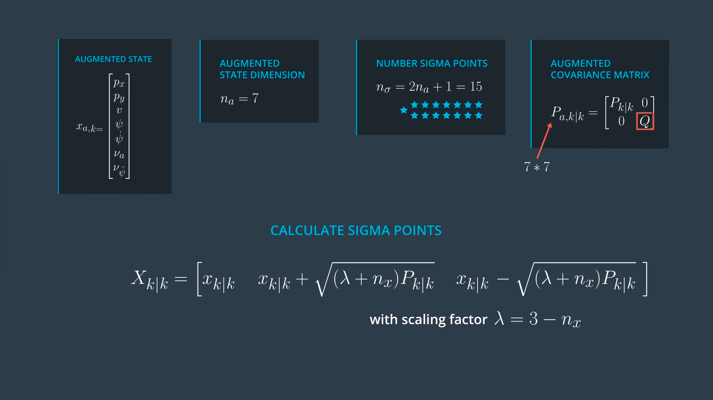
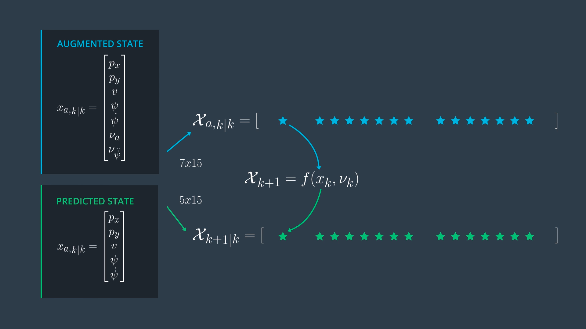
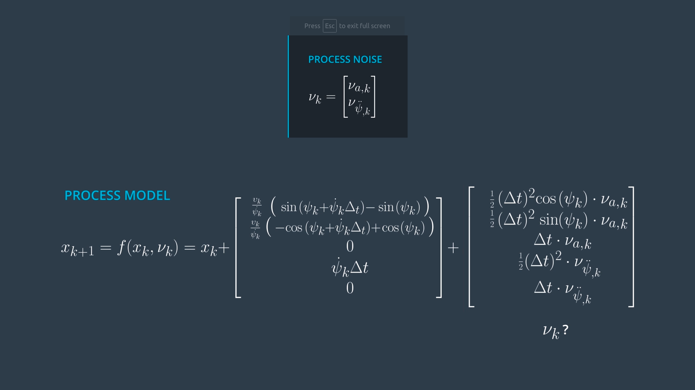
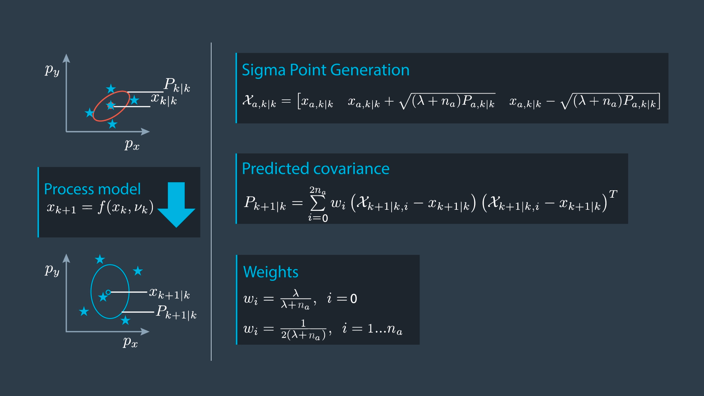
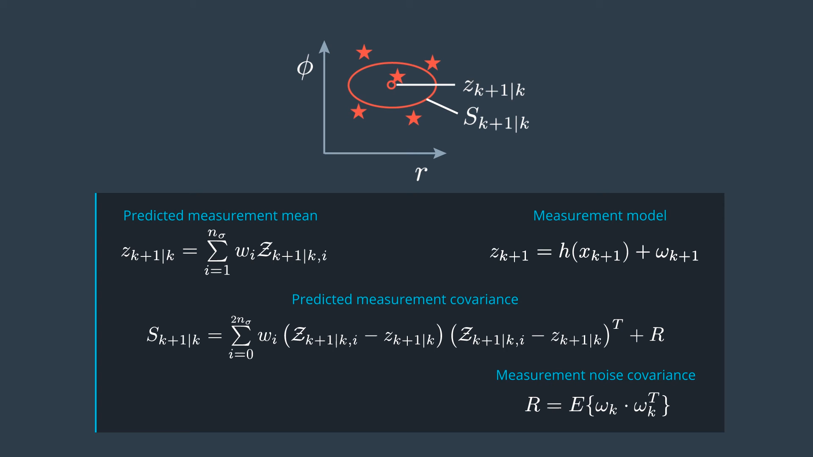
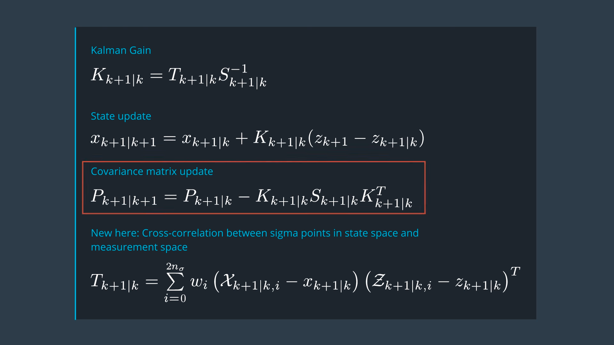

# SFND_Unscented_Kalman_Filter
Sensor Fusion UKF Highway Project Starter Code


In this project, I implemented an Unscented Kalman Filter to estimate the state of multiple cars on a highway using noisy lidar and radar measurements. 

`main.cpp` is using `highway.h` to create a straight 3 lane highway environment with 3 traffic cars and the main ego car at the center. 
The viewer scene is centered around the ego car and the coordinate system is relative to the ego car as well. The ego car is green while the 
other traffic cars are blue. The traffic cars will be accelerating and altering their steering to change lanes. Each of the traffic car's has
it's own UKF object generated for it, and will update each indidual one during every time step. 

The red spheres above cars represent the (x,y) lidar detection and the purple lines show the radar measurements with the velocity magnitude along the detected angle. The Z axis is not taken into account for tracking, so cars are only tracked along the X/Y axis.

---

## Other Important Dependencies
* cmake >= 3.5
  * All OSes: [click here for installation instructions](https://cmake.org/install/)
* make >= 4.1 (Linux, Mac), 3.81 (Windows)
  * Linux: make is installed by default on most Linux distros
  * Mac: [install Xcode command line tools to get make](https://developer.apple.com/xcode/features/)
  * Windows: [Click here for installation instructions](http://gnuwin32.sourceforge.net/packages/make.htm)
* gcc/g++ >= 5.4
  * Linux: gcc / g++ is installed by default on most Linux distros
  * Mac: same deal as make - [install Xcode command line tools](https://developer.apple.com/xcode/features/)
  * Windows: recommend using [MinGW](http://www.mingw.org/)
 * PCL 1.2


## How to run

```shell
$ mkdir build
$ cd build
$ cmake ..
$ make
$ ./ukf_highway
```

## Code Style

- [Google's C++ style guide](https://google.github.io/styleguide/cppguide.html).

## Steps to implement the Unscented Kalman Filter (UKF)


1. Prediction

    1.1. Generate Sigma Points

    


    1.2. Predict Sigma Points

    

    


    1.3. Predict Mean and Covariance

    

2. Update

    2.1. Predict Measurement

    

    2.2. Update State

    