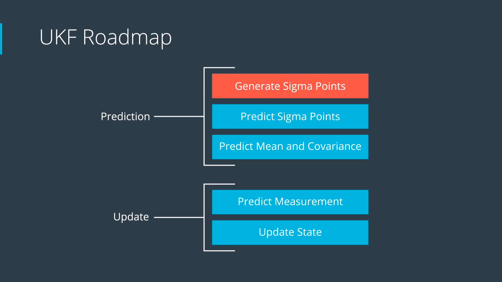

# SFND_Unscented_Kalman_Filter
Sensor Fusion UKF Highway Project Starter Code


In this project, I implemented an Unscented Kalman Filter to estimate the state of multiple cars on a highway using noisy lidar and radar measurements. 

`main.cpp` is using `highway.h` to create a straight 3 lane highway environment with 3 traffic cars and the main ego car at the center. 
The viewer scene is centered around the ego car and the coordinate system is relative to the ego car as well. The ego car is green while the 
other traffic cars are blue. The traffic cars will be accelerating and altering their steering to change lanes. Each of the traffic car's has
it's own UKF object generated for it, and will update each indidual one during every time step. 

The red spheres above cars represent the (x,y) lidar detection and the purple lines show the radar measurements with the velocity magnitude along the detected angle. The Z axis is not taken into account for tracking, so cars are only tracked along the X/Y axis.

---

## Other Important Dependencies
* cmake >= 3.5
  * All OSes: [click here for installation instructions](https://cmake.org/install/)
* make >= 4.1 (Linux, Mac), 3.81 (Windows)
  * Linux: make is installed by default on most Linux distros
  * Mac: [install Xcode command line tools to get make](https://developer.apple.com/xcode/features/)
  * Windows: [Click here for installation instructions](http://gnuwin32.sourceforge.net/packages/make.htm)
* gcc/g++ >= 5.4
  * Linux: gcc / g++ is installed by default on most Linux distros
  * Mac: same deal as make - [install Xcode command line tools](https://developer.apple.com/xcode/features/)
  * Windows: recommend using [MinGW](http://www.mingw.org/)
 * PCL 1.2


## How to run

```shell
$ mkdir build
$ cd build
$ cmake ..
$ make
$ ./ukf_highway > ../check_consistance/nis_data.txt
```


## Code Style

- [Google's C++ style guide](https://google.github.io/styleguide/cppguide.html).

## Steps to implement the Unscented Kalman Filter (UKF)



1. Prediction

    1.1. Generate Sigma Points

    

    The part is implemented in `GenerateAugmentedSigmaPoints()` method in the file `src/ukf.cpp` (from line **#241** to line **#262**).


    1.2. Predict Sigma Points

    

    

    The part is implemented in `SigmaPointPrediction()` method in the file `src/ukf.cpp` (from line **#264** to line **#306**).

    1.3. Predict Mean and Covariance

    

    The part is implemented in `PredictMeanAndCovariance()` method in the file `src/ukf.cpp` (from line **#308** to line **#322**).

2. Update

    This part consists of 2 sub-tasks: Predict Measurement and Update State.
    The implementation is a bit different between LiDAR and RADAR. Hence, I have used 2 functions: `UpdateLidar()` (from line **#134** to line **#177**) and `UpdateRadar()` (from line **#179** to line **#239**) for the two kind of sensors.

    2.1. Predict Measurement

    

    

    2.2. Update State

    

3. Consistance check using Normalized innovation Squared (NIS)

  

  

  To check whether the noise values are reasonable, we can use the Normalized Innovation Squared (NIS) statistic.
  A good way to check this is to plot the NIS statistic for both RADAR and LASER measurements along with the corresponding 95% confidence threshold:
  - **RADAR:** 7.815 for 3 degrees of freedom (DOF)
  - **LASER:** 5.991 for 2 DOF.  
  
  If our noise is consistent, we should see roughly 95% of NIS values computed from measurements fall below the confidence threshold.

  **How to tune the noise values:**

  - If much more than 5% of the NIS values computed from measurements exceed the threshold, it means that our measurements are actually being drawn from a distribution with a greater variance than we assumed.  
  Hence, we have underestimated the process noise, and should increase it.  

  - If all of the NIS values computed from measurements is below the threshold, it means that our measurements are being drawn from a distribution with smaller variance than we assumed.  Hence, we have overestimated our process noise, and should decrease it.


  To check filter consistance with NIS, please execute:

  ```shell
  $ cd check_consistance
  $ python3 check_consistance_nis.py
  ```

  My results with `std_a_ = 6. m/s^2` and `std_yawdd_ = 1.5 rad/s^2`:

  